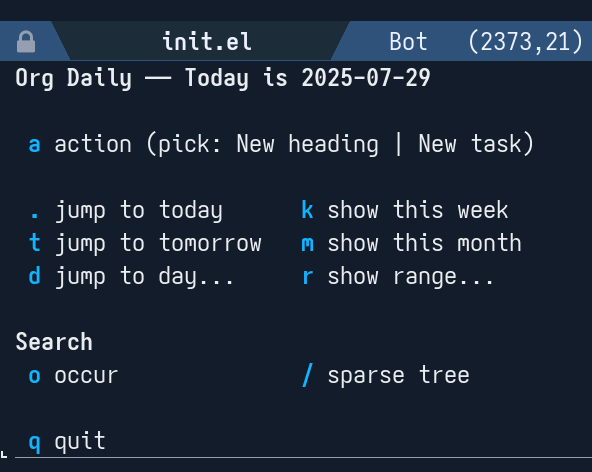

# org-daily: maintain a journal in a single Org file

`org-daily` can be a lot of things. The most accurate description I can think of is *a package designed to help you in the maintenance of date trees*.

OK, maybe that doesn't say much. A *date tree* is just a regular Org tree, where every first level heading is a year, every second level heading is a month, and every third level heading is a day. In short, it looks like this:

```
​* 2025
** 2025-07 July
*** 2025-07-28 Monday
*** 2025-07-29 Tuesday
```

As to *why* would you want something like that, it's really up to you. `org-daily` lights the flame and leaves the cooking to you. But for the purpose of this gentle introduction, let's stick to what is probably the most common usecase, journaling.

So, you type `M-x org-daily` (you probably will bind it to a comfortable key). A transient UI will appear.

[](./transient.png)

I tried very hard to make the transient self-explanatory, so you can just play around. For now, let's type `a` to select the `New heading` quick action, and then `.` for today (we use the dot because that's the Emacs standard binding for today, as in the calendar and agenda). So you end up in a buffer showing this:

```txt
*** 2025-07-29 Tuesday
**** 
```

Is the tree cut? Well, no, the buffer is just *narrowed*; you can't see it all, only the current date. This helps with focus. Now, just write anything.

```txt
*** 2025-07-29 Tuesday
**** Hello World!
This is my first journal entry!
```

At any time, from anywhere, you can jump to current day with `<KEY> .` (with `<KEY>` being your binding for `org-daily`). And create a new heading with `<KEY> a .`. It's that easy.

You can jump to the entry for any past (or future, though that's hardly useful for a journal!) date with `<KEY> d`. You can also create a heading for any date using a binding you can already imagine: `<KEY> a d`. And you can quickly navigate between dates in your file with `<KEY> n` and `<KEY> p`.

An important thing is searching: you can invoke occur with `<KEY> o` (if you don't know occur, you should learn it, it's great!). And, as all your entries are located in a single file, you can also use the amazing and underrated `org-sparse-tree` with `<KEY> /`.

You can keep exploring the transient, but that's really all you need to know for journaling.

Anyway, date trees are such a powerful concept that you should not restrict it to a journal. How about a reminder system? Just `<KEY> a d`, pick a date in the future and start writing. If you want to be sure you don't miss it, add a deadline with `C-c C-d` (make sure you enable `org-daily-override-date-mode`) and add the file to your agenda. As simple as:

```elisp
(add-to-list 'org-agenda-files org-daily-file)
```

Task management? Day planning? The sky is the limit!

Maybe you'll find out you like `org-daily` so much you wish you could use more than one file. Well, you can! Just customize `org-daily-all-files`. For instance:

```elisp
(setq org-daily-all-files
      '(("Journal" . "~/Documents/journal.org")
        ("Day planning" . "~/Documents/days.org")
        ("Happiness report" . "~/Documents/happiness.org")))
```

Once you've configured it, you'll be able to switch files interactively with `<KEY> f`. It is as intuitive as it sounds!

Now, there's a lot more (like refiling entries to other days, and even a set of days). But the best thing is the ability to customize the package to your liking. You can customize the date format, create your own custom actions for `<KEY> a`, add functions to run after jumping or refiling, and so on. Just `M-x customize-group RET org-daily RET`.

Read The Fine Manual if you want to know more about this package (really, a lot of work went to that manual).

So, are you ready to live your days with `org-daily`?

## Installation

The minimum Emacs version supported is 29.1.  The package has no
dependencies besides built-in libraries.

Install from source by evaluating the following code:

```elisp
(package-vc-install
 '(org-daily
   :url "https://github.com/lmq-10/org-daily"
   :doc "README.org"))
```

Alternatively, download the `org-daily.el` file from this repo and
store it somewhere in your `load-path`.

## Sample configuration

```elisp
(use-package org-daily
  :ensure t
  :bind
  ;; Customize keybindings to your liking
  (("C-c d" . org-daily)
   ("C-c D" . org-daily-today)
   :map calendar-mode-map
   ("j" . org-daily-jump-from-calendar))
   :map occur-mode-map
   ("d" . org-daily-occur-display-date))
```
